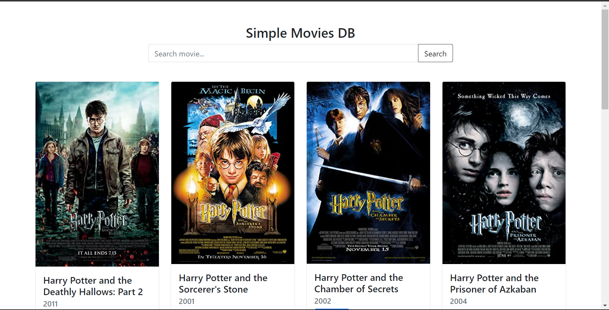
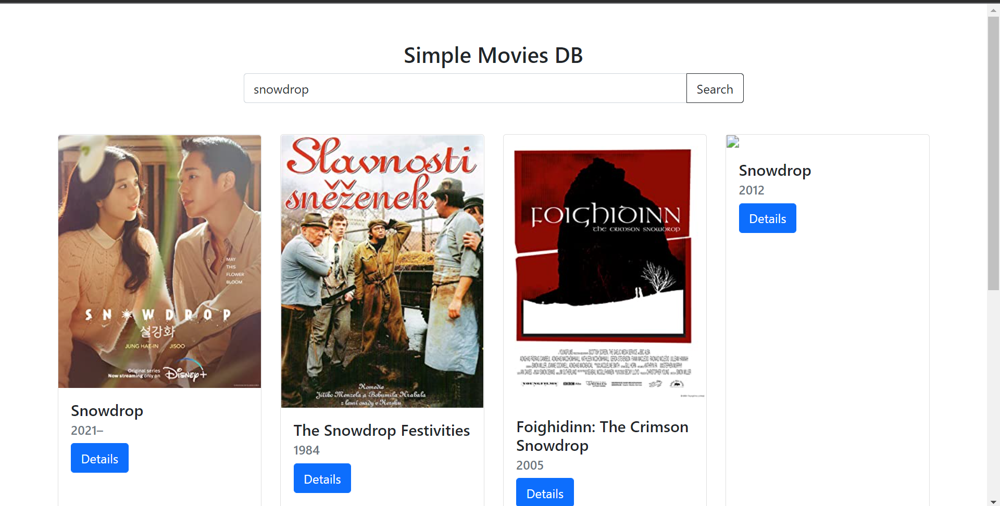
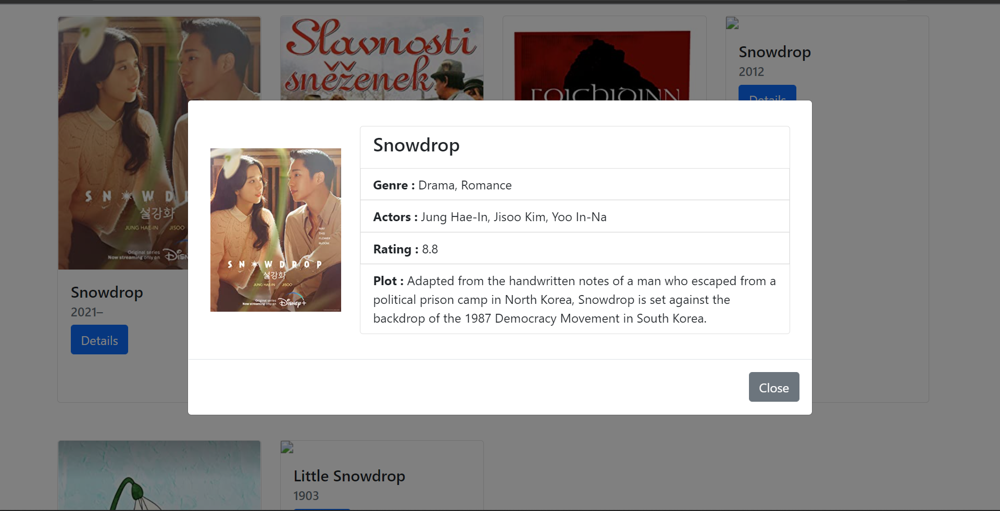

# OMDB_API_Simple_Web

**Simple website that implement OMDB API and AJAX**

P.s: If there's missing data like the image,etc it's because the database/API

**Default Landing**

**Search**

**Details**

